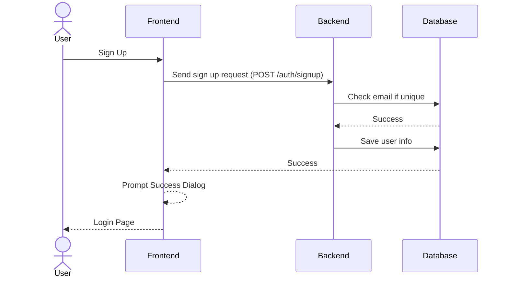
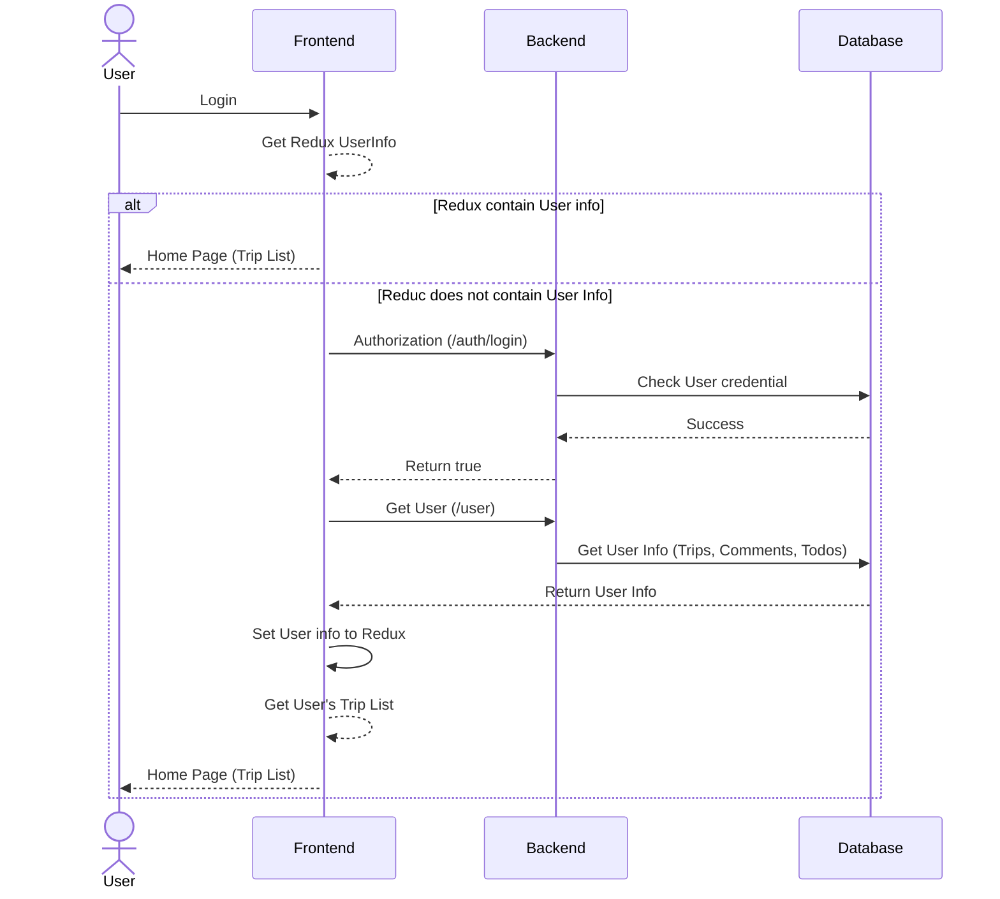
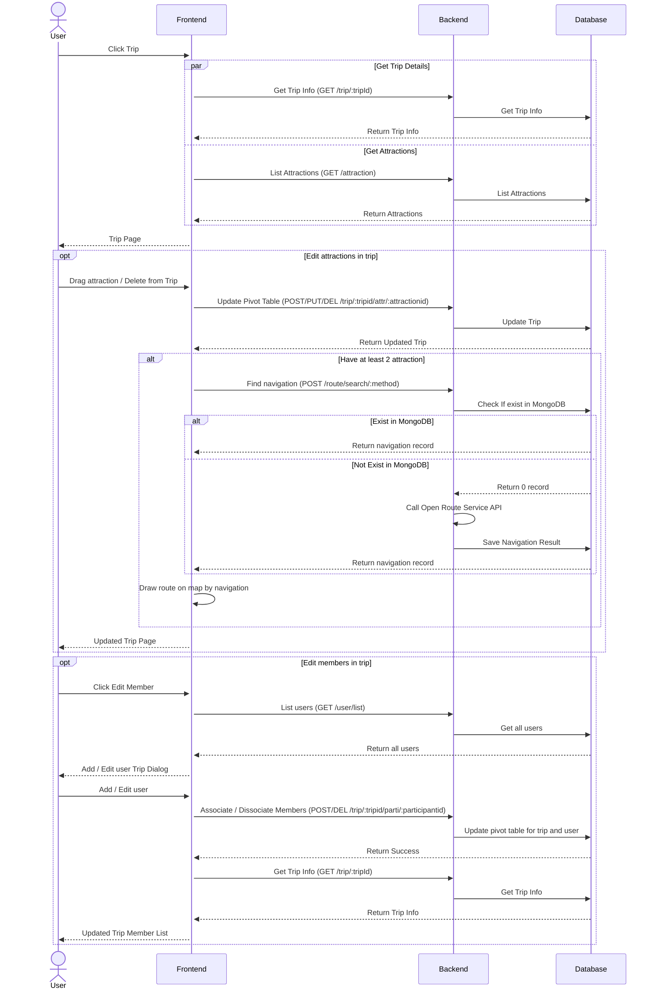
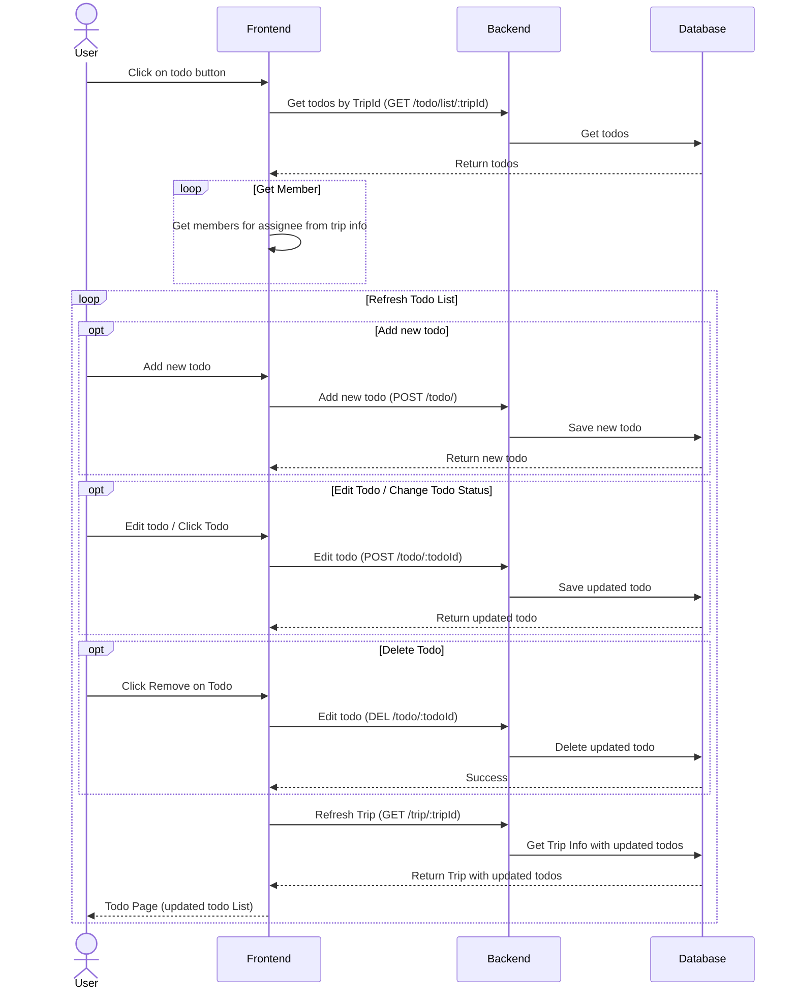
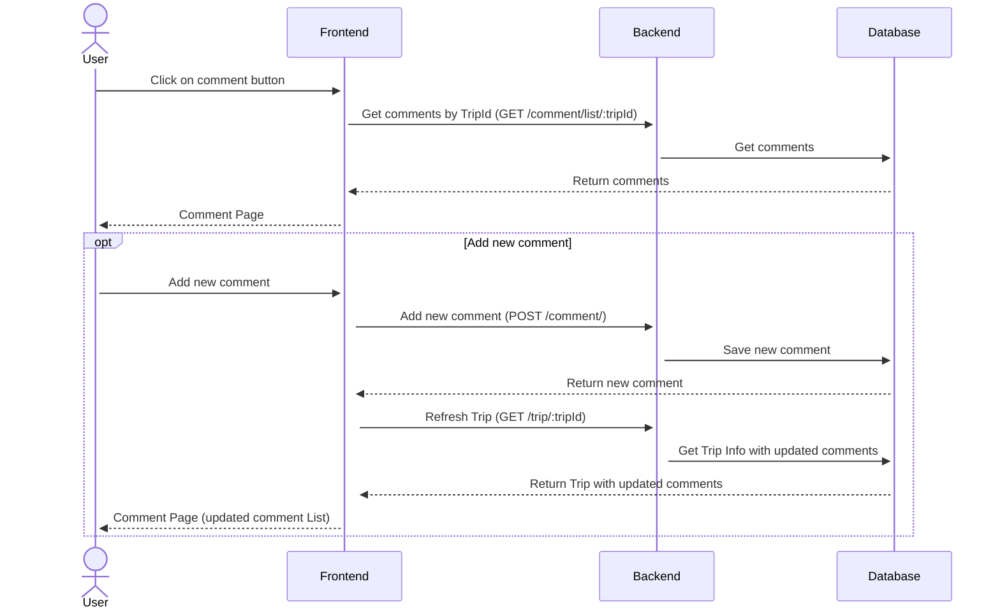

# Cantek Oct Web Project Organization

# Travel Planner

<!-- TABLE OF CONTENTS -->
<details>
  <summary>Table of Contents</summary>
  <ol>
    <li>
      <a href="#about-this-project">About This Project</a>
      <ul>
        <li><a href="#feature">Feature</a></li>
        <li>
            <a href="#tech-stack">Tech Stack</a>
            <ul>
                <li><a href="#frontend">Frontend</a></li>
                <li><a href="#backend">Backend</a></li>
                <li><a href="#infra">Infra</a></li>
            </ul>
        </li>
      </ul>
    </li>
    <li><a href="#getting-started">Getting Started</a></li>
    <li>
        <a href="#logic-for-each-pages">Logic for each pages</a>
        <ul>
            <li><a href="#sign-up">Sign Up</a></li>
            <li><a href="#login">Login</a></li>
            <li><a href="#trip-scheduler">Trip Scheduler</a></li>
            <li><a href="#todo">Todo</a></li>
            <li><a href="#comment">Comment</a></li>
        </ul>
    </li>
    <li><a href="#future-improvement">Future Improvement</a></li>
    <li><a href="#contact">Contact</a></li>
    <li><a href="#acknowledgments">Acknowledgments</a></li>
  </ol>
</details>

## About this project

Trip planning is one of the difficult challenge for a enjoyable travel. People may have planned a lot of places to visit. People may not where to go in a city. This application can help for solving the problems. 

### Feature
- Syncing the trip planning
- Attractions List to choose
- Drawing the route for car driving
- Estimate time used for trip
- Easy drag and drop

### Tech stack
#### Frontend
- [![Typescript][Typescript]][Typescript-url]
- [![React][React.js]][React-url]
- [![Redux][Redux.js]][Redux-url]
- [![Vite][Vite.js]][Vite-url]
- [![Tailwind][Tailwindcss.com]][Tailwindcss-url]
- [![MUI][Mui.com]][Mui-url]

#### Backend
- [![NodeJS][Node.js]][Node-url]
- [![Express][Express.js]][Express-url]
- [![TypeORM][TypeORM.io]][TypeORM-url]
- [![Zod][Zod.dev]][Zod-url]
- [![Winston][Winston]][Winston-url]

#### Infra
- [![PostgreSQL][PostgresSQL.org]][Postgres-url]
- [![MongoDB][MongoDB.com]][MongoDB-url]
- [![Postgis][Postgis.net]][Postgis-url]
- [![Redis][Redis.io]][Redis-url]
- [![Docker][Docker.com]][Docker-url]
- [![Nginx][Nginx.com]][Nginx-url]
- [![PM2][PM2.io]][PM2-url]
- [![AWSEC2][AWS.EC2]][EC2-url]

<p align="right">(<a href="#travel-planner">back to top</a>)</p>

## Getting Started

Please first clone the three repos 
* [Infra](https://github.com/cantek2023OctWebECEC/infra)
* [Frontend](https://github.com/cantek2023OctWebECEC/front-end)
* [Backend](https://github.com/cantek2023OctWebECEC/api-server)

Follow the ```Readme``` file to setup. 
Then follow the ```.env.example``` to change the environment value

<p align="right">(<a href="#travel-planner">back to top</a>)</p>

## Logic for each pages

### Sign Up

---
### Login

---
### Trip Scheduler

---
### Todo

---
### Comment


<p align="right">(<a href="#travel-planner">back to top</a>)</p>

## Future Improvement

- [ ] Add websocket to adopt to push notification and real time update upon everyone with concurrent connection
- [ ] Add restaurants for choosing
- [ ] Add status monitor and crashlytics using sentry
- [ ] Add more filter on attraction list (category, fare, opening hours etc.)
- [ ] Support places outside toronto
- [ ] Add better time estimation of each attractions
- [ ] Add more routing options and fare calculations
- [ ] Add AI to optimize the route (save money and time by taking traffic congestion,attraction openings, attraction fares into account)
- [ ] Allow user to purchase ticket and redeem online

<p align="right">(<a href="#travel-planner">back to top</a>)</p>

## Contact
Edward Wong - [![Github][github-shield]][github-edward-url] [![LinkedIn][linkedin-shield]][linkedin-edward-url] [![Mail][gmail-shield]][gmail-edward-url]

Eric Sham - [![Github][github-shield]][github-eric-url] [![LinkedIn][linkedin-shield]][linkedin-eric-url]  [![Mail][gmail-shield]][gmail-eric-url]

Coco Yu - [![Github][github-shield]][github-coco-url] [![LinkedIn][linkedin-shield]][linkedin-coco-url]  [![Mail][gmail-shield]][gmail-coco-url]

Calvin Chan - [![Github][github-shield]][github-calvin-url] [![LinkedIn][linkedin-shield]][linkedin-calvin-url]  [![Mail][gmail-shield]][gmail-calvin-url]

<p align="right">(<a href="#travel-planner">back to top</a>)</p>

## Acknowledgments

* [Map (Open Street Map)](https://www.openstreetmap.org)
* [Planner Component](https://github.com/atlassian/react-beautiful-dnd)
* [Path Finding Optimization](https://github.com/GIScience/openrouteservice-js)
* [Img Shields](https://shields.io)

<p align="right">(<a href="#travel-planner">back to top</a>)</p>

<!-- MARKDOWN LINKS & IMAGES -->
[Typescript]: https://img.shields.io/badge/typescript-3178C6?style=for-the-badge&logo=typescript&logoColor=white
[Typescript-url]: https://www.typescriptlang.org/
[React.js]: https://img.shields.io/badge/React-20232A?style=for-the-badge&logo=react&logoColor=61DAFB
[React-url]: https://reactjs.org/
[Redux.js]: https://img.shields.io/badge/Redux-20235A?style=for-the-badge&logo=redux&logoColor=764ABC
[Redux-url]: https://redux.js.org/
[Vite.js]: https://img.shields.io/badge/Vite-646CFF?style=for-the-badge&logo=vite&logoColor=white
[Vite-url]: https://vitejs.dev/
[Tailwindcss.com]: https://img.shields.io/badge/tailwind_CSS-06B6D4?style=for-the-badge&logo=Tailwind%20CSS&logoColor=white
[Tailwindcss-url]: https://tailwindcss.com/
[Mui.com]: https://img.shields.io/badge/mui-007FFF?style=for-the-badge&logo=MUI&logoColor=white
[Mui-url]: https://mui.com/
[Node.js]: https://img.shields.io/badge/NodeJS-339933?style=for-the-badge&logo=nodedotjs&logoColor=white
[Node-url]: https://nodejs.org/
[Express.js]: https://img.shields.io/badge/Express-000000?style=for-the-badge&logo=express&logoColor=white
[Express-url]: https://expressjs.com/
[TypeORM.io]: https://img.shields.io/badge/TypeORM-EF2D5E?style=for-the-badge
[TypeORM-url]: https://typeorm.io/
[Zod.dev]: https://img.shields.io/badge/zod-171717?style=for-the-badge&logo=zod&logoColor=3E67B1
[Zod-url]: https://zod.dev/
[Winston]: https://img.shields.io/badge/Winston_logger-565656?style=for-the-badge
[Winston-url]: https://github.com/winstonjs/winston
[PostgresSQL.org]: https://img.shields.io/badge/PostgresSQL-111111?style=for-the-badge&logo=postgresql&logoColor=4169E1
[Postgres-url]: https://www.postgresql.org/
[MongoDB.com]: https://img.shields.io/badge/MongoDB-101010?style=for-the-badge&logo=mongodb&logoColor=47A248
[MongoDB-url]: https://www.mongodb.com/
[Postgis.net]: https://img.shields.io/badge/Postgis-112b3c?style=for-the-badge
[Postgis-url]: https://postgis.net/
[Redis.io]: https://img.shields.io/badge/redis-111111?style=for-the-badge&logo=redis&logoColor=DC382D
[Redis-url]: https://redis.io/
[Docker.com]: https://img.shields.io/badge/docker-2496ED?style=for-the-badge&logo=docker&logoColor=white
[Docker-url]: https://www.docker.com/
[Nginx.com]: https://img.shields.io/badge/nginx-131313?style=for-the-badge&logo=nginx&logoColor=009639
[Nginx-url]: https://www.nginx.com/
[Pm2.io]: https://img.shields.io/badge/pm2-2B037A?style=for-the-badge&logo=pm2&logoColor=white
[Pm2-url]: https://pm2.keymetrics.io/
[aws.ec2]: https://img.shields.io/badge/Amazon_EC2-1A1A1A?style=for-the-badge&logo=amazonec2&logoColor=#FF9900
[ec2-url]: https://aws.amazon.com/ec2/
[linkedin-shield]: https://img.shields.io/badge/-LinkedIn-black.svg?style=for-the-badge&logo=linkedin&colorB=555
[linkedin-edward-url]: https://www.linkedin.com/in/yuk-ming-wong-003bab149/
[linkedin-eric-url]: https://linkedin.com/in/eric-sham-ph/
[linkedin-coco-url]: https://www.linkedin.com/in/cocoyu2023/
[linkedin-calvin-url]: https://www.linkedin.com/in/calvin-chan-profile2023/
[gmail-shield]: https://img.shields.io/badge/Email-EA4335?style=for-the-badge&logo=gmail&logoColor=white
[gmail-edward-url]: mailto:eternal.edward1997@gmail.com
[gmail-eric-url]: mailto:hei9988@gmail.com
[gmail-coco-url]: mailto:coco2023.ca@gmail.com
[gmail-calvin-url]: mailto:calvinkanca@gmail.com
[github-shield]: https://img.shields.io/badge/Github-181717?style=for-the-badge&logo=github&logoColor=white
[github-edward-url]: https://github.com/DrEdwardPCB
[github-eric-url]: https://github.com/humanhei
[github-coco-url]: https://github.com/Coco2023ca
[github-calvin-url]: https://github.com/cck2011